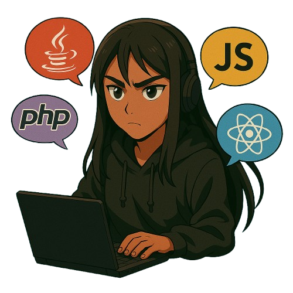

  
  
  
  

    
  

  

    
  

  

  <h2 style="color:#9d4edd; font-size: 1.8em; margin-bottom: 10px;">Sobre Mim</h2>
  

    Olá, meu nome é Amanda Kelory! 
    Desenvolvedora Full Stack Jr apaixonada por tecnologia e sempre em busca de novos conhecimentos. 
    Adoro colaborar em projetos desafiadores e estou constantemente explorando novas tecnologias para expandir meu conjunto de habilidades.
  

  <h2 style="color:#9d4edd; font-size: 1.8em; margin-bottom: 15px;">Conecte-se comigo</h2>
  

    
  

  

  
  
  

  <h2 style="color:#9d4edd; font-size: 1.8em; margin-bottom: 20px;">Tech Stack</h2>
  
  

    <table align="center" cellspacing="10" cellpadding="10">
      <tr>
        <td align="center" width="96">
          
           Java
        </td>
        <td align="center" width="96">
          
           PHP
        </td>
        <td align="center" width="96">
          
           JavaScript
        </td>
        <td align="center" width="96">
          
           React
        </td>
        <td align="center" width="96">
          
           Spring
        </td>
      </tr>
      <tr>
        <td align="center" width="96">
          
           Laravel
        </td>
        <td align="center" width="96">
          
           React Native
        </td>
        <td align="center" width="96">
          
           Tailwind
        </td>
        <td align="center" width="96">
          
           Node.js
        </td>
        <td align="center" width="96">
          
           MySQL
        </td>
      </tr>
      <tr>
        <td align="center" width="96">
          
           MongoDB
        </td>
        <td align="center" width="96">
          
           Git
        </td>
        <td align="center" width="96">
          
           VSCode
        </td>
        <td align="center" width="96">
          
           Postman
        </td>
        <td align="center" width="96">
          
           Blade
        </td>
      </tr>
      <tr>
        <td align="center" width="96">
          
           NPM
        </td>
        <td align="center" width="96">
          
           Yarn
        </td>
        <td align="center" width="96">
          
           Vite
        </td>
        <td align="center" width="96">
          
           Composer
        </td>
        <td align="center" width="96">
          
           Insomnia
        </td>
      </tr>
    </table>
  

  <h2 style="color:#9d4edd; font-size: 1.8em; margin-bottom: 15px;">Aprendizado atual</h2>
  

    
    
    
    
  

  <h2 style="color:#9d4edd; font-size: 1.8em; margin-bottom: 15px;">Projetos destaques</h2>
  

    <a href="https://github.com/Blaackmind/EasyMovie" style="color:#9d4edd; text-decoration: none; margin: 0 10px;">🎬 EasyMovie App</a> • 
    <a href="https://github.com/Blaackmind/dashboard_enki" style="color:#9d4edd; text-decoration: none; margin: 0 10px;">📊 Admin Dashboard</a>
  

  

  

  
  

    
  

  
Obrigada por visitar meu perfil!

  

